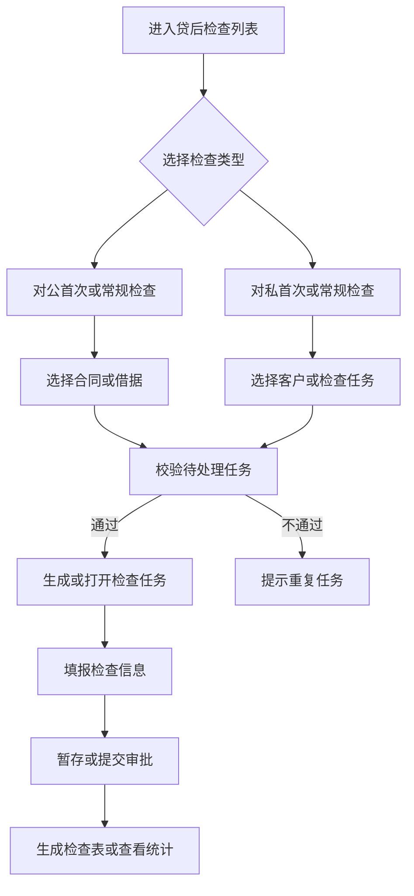
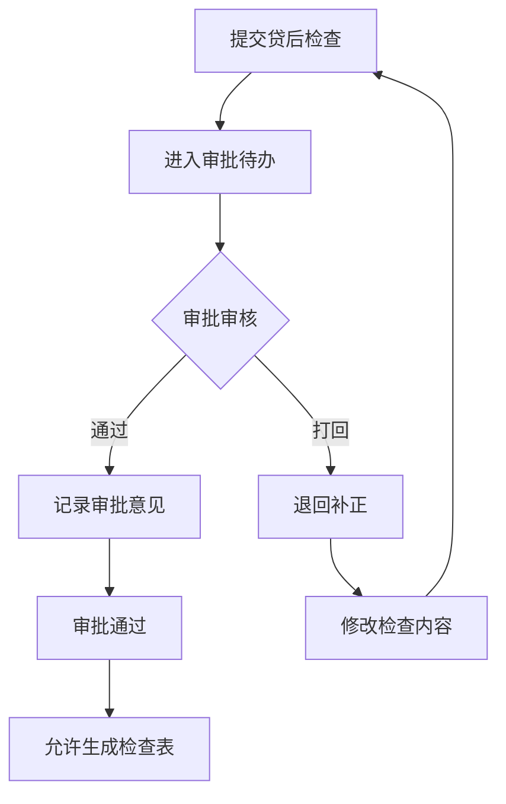
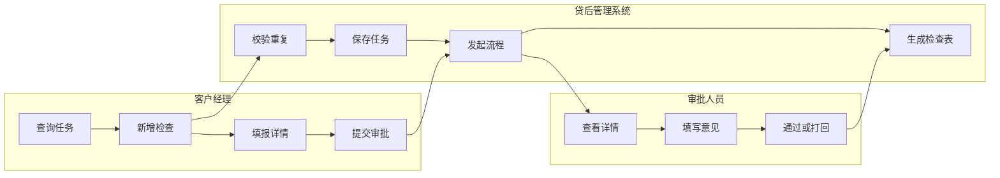

<!-- 标题路径: 贷后检查/总体描述 -->
<!-- ZJJK: 无 -->

## 要点摘要

- 贷后检查覆盖对公和零售客户放款后的首次检查、常规检查、预警核查、检查结果填报与审批流转；客户经理按合同/借据发起任务，按产品、客户、合同、借据、任务要求完成时间、流程发起时间和流程状态查询。
- 任务页维护：贷款基本信息、客户基本信息、用信情况、财务状况、检查情况、预警信息、检查结果、影像资料；对公覆盖法人贷款、流贷、房地产开发贷、项目贷；对私支持农户小额贷、通用人工检查与自动检查结果展示。
- 系统校验同一合同/借据是否存在待处理任务，避免重复发起；首次检查按规则配置计算任务要求完成日期。
- 三张 mermaid 流程图：客户经理操作全流程（对私/对公分叉→填报→生成检查表）、审批流程（提交→审批→通过/打回→归档）、角色×外部系统泳道。

## 关键规则/字段/校验

- 流程状态机：新建检查→保存任务→待发起；待发起→提交流程审批→待处理；待处理→审批通过/审批退回→打回。
- 预警信息状态机：未获取预警信息→获取预警信息→已获取预警信息；非暂存保存前必须取得预警信息，否则保存中断。
- 待处理：同一合同或借据已有进行中检查任务时禁止重复创建；审批通过后同一借据无需再次发起首次检查。

## 待湿测

- 文档口径与 SUT 实际差异需湿测确认：文中按钮/字段以需求文档为准，实际系统字段编码、菜单路径、权限角色可能不同。

---

# 贷后检查
## 总体描述
### 功能说明
贷后检查用于对公司和零售客户贷款在放款后开展首次检查、常规检查、预警核查、检查结果填报和审批流转。客户经理可以通过选择合同或借据发起检查任务，按产品、客户、合同、借据、任务要求完成时间、流程发起时间和流程状态查询任务，并在任务页维护贷款基本信息、客户基本信息、用信情况、财务状况、检查情况、预警信息、检查结果和影像资料。对公检查覆盖法人贷款、流动资金贷款、房地产开发贷款和项目贷款等场景，对私检查支持农户小额贷、通用人工检查和自动检查结果展示。
检查过程中系统会校验同一合同或借据是否存在待处理任务，避免重复发起；首次检查还会按规则配置计算任务要求完成日期。审批人员在任务页、审批意见和提交流程审批页面查看检查详情、保存意见并办理流程，统计页面用于后续查询贷后检查统计信息。
### 业务流程图
#### 客户经理操作全流程
描述任务查询、新增检查、填报检查结果和生成检查表的主路径。

```
#### 审批流程
描述提交后的审批办理、打回和通过路径。

```
#### 角色×外部系统泳道
展示客户经理、审批人员和贷后管理系统的职责边界。

```
### 状态说明
贷后检查流程状态 - 检查任务创建、补正和审批结果的阶段标识
状态清单：
待提交：对私首次检查新建后尚未提交，客户经理可继续填报检查内容。
待发起：任务创建或暂存后处于可补充阶段，可同步合同金额、合同余额和五级分类后继续办理。
打回：审批退回后允许重新修改检查信息，再次补充后继续提交。
待处理：同一合同或借据已有进行中的检查任务时，系统禁止重复创建。
审批通过：首次贷后检查已经审批完成，同一借据无需再次发起首次检查。
状态机：
新建检查 → 保存任务 → 待发起
待发起 → 提交流程审批 → 待处理
待处理 → 审批通过 → 审批通过
待处理 → 审批退回 → 打回
预警信息状态 - 检查任务是否已经完成预警信息获取的标识
状态清单：
未获取预警信息：非暂存保存前需要取得预警信息，否则检查保存会被中断。
已获取预警信息：点击获取并成功刷新预警列表后，任务保留已获取结果供后续保存和审批使用。
状态机：
未获取预警信息 → 获取预警信息 → 已获取预警信息
