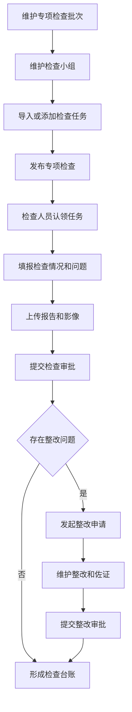
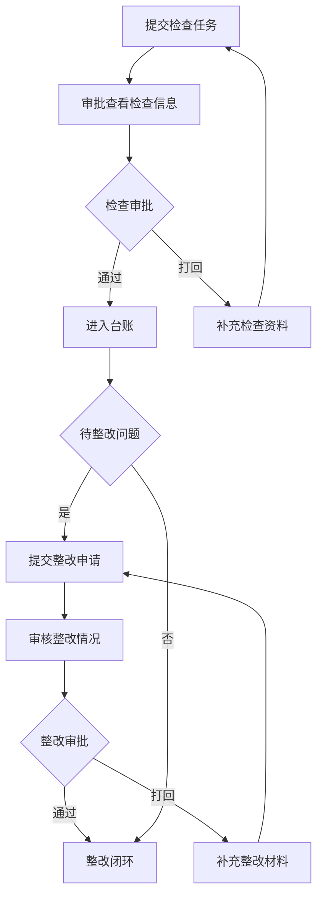
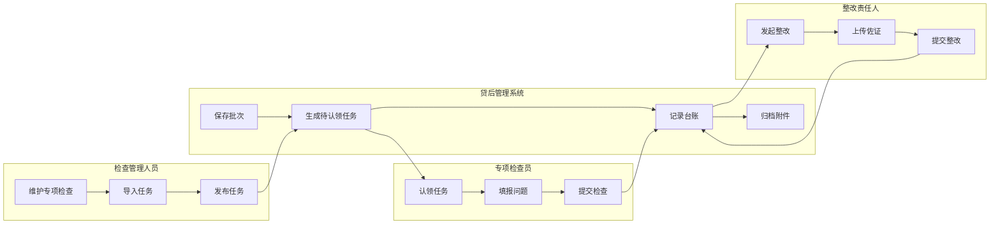

<!-- 标题路径: 专项检查/总体描述 -->
<!-- ZJJK: 无 -->

## 要点摘要

- 专项检查闭环：任务发起（批次+团队+问题清单）→对象导入（文件/台账/添加）→检查员认领→现场检查填报问题→审批→整改申请→台账/影像归档→整体问责。
- 角色分工：检查管理人员（批次、团队、问题清单、报告）、检查人员（认领、填报、审批）、整改责任人（整改申请）、部门综合员/主查小组长（任务变更）。
- 各查询页按专项检查编号、名称、合同、客户、机构、检查日期、流程状态定位数据。

## 关键规则/字段/校验

- 流程状态机：待处理→流程提交→已处理（详见正文）。

## 待湿测

- 文档口径与 SUT 实际差异需湿测确认：文中按钮/字段以需求文档为准，实际系统字段编码、菜单路径、权限角色可能不同。

---

# 专项检查
## 总体描述
### 功能说明
专项检查用于围绕特定检查内容，组织任务发起、对象导入、现场检查、问题整改、台账查询和问责处理。检查管理人员可以维护专项检查批次、检查团队、管理组、问题清单和检查报告，检查人员可以认领任务、填报检查问题并提交审批。整改责任人可以基于已发布且存在问题的检查任务发起整改申请，补充整改描述、整改结束日期和佐证材料，后续台账按检查业务、合同、客户、检查日期和未整改问题数跟踪处理结果。
检查过程同时提供事实确认书、影像资料、补充附件、历史检查信息、整体问责和检查报告维护能力，使专项检查从计划发布到问题闭环留有可查询的业务记录。各查询页面按专项检查编号、名称、合同、客户、机构、检查日期、流程状态等条件定位数据，便于管理人员和经办人员分角色办理检查工作。
### 业务流程图
#### 客户经理操作全流程
描述批次维护、任务导入、检查办理到整改闭环的主路径。

```
#### 审批流程
描述专项检查任务与整改申请审批流转。

```
#### 角色×外部系统泳道
展示检查管理、检查执行、整改办理和系统支撑边界。

```
### 状态说明
专项检查状态 - 专项检查批次从登记到可办理的发布阶段标识
状态清单：
待发布：新增专项检查保存后尚未发布，可继续维护检查名称、检查日期、检查内容和检查团队。
已发布：任务可被整改申请选择，检查对象可进入认领、检查和整改办理。
状态机：
待发布 → 发布专项检查 → 已发布
任务认领状态 - 检查任务是否已由检查人员承接的办理标识
状态清单：
未认领：认领弹窗默认展示的待承接任务，可由参与该批次的人员办理认领。
已认领：任务进入本人经办列表，可查询、填报检查内容、查看影像资料并办理流程。
状态机：
未认领 → 认领任务 → 已认领
整改状态 - 检查发现问题整改结果的业务标识
状态清单：
未整改：存在仍未完成整改的问题，整体问责列表按该状态提示整改未闭环。
已整改：整改情况保存为情况属实且已整改后，问题整改结果可作为已闭环记录展示。
状态机：
未整改 → 保存整改情况 → 已整改
流程处理状态 - 审批历史中当前任务办理进展的展示标识
状态清单：
待处理：流程已有当前待办任务，办理人员可进入签署意见或流程操作继续提交。
已处理：当前流程任务已完成办理，审批历史按处理时间展示办理结果。
状态机：
待处理 → 流程提交 → 已处理
