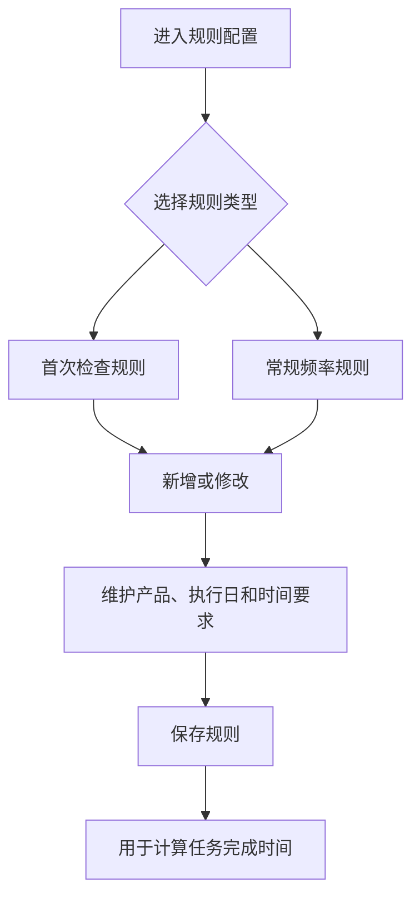
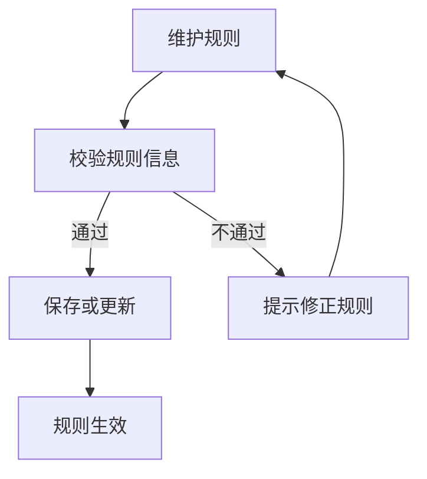
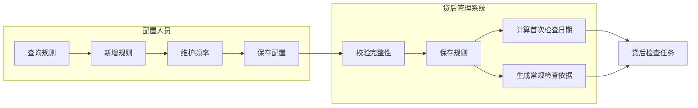

<!-- 标题路径: 贷后检查配置（总体描述/贷后检查规则配置） -->
<!-- ZJJK: ZJJK00095580, ZJJK00110957, ZJJK00110958, ZJJK00110959 -->

## 要点摘要

- 贷后检查规则配置两类：常规贷后检查频率配置（客户类别、产品类别、风险分类、合同金额阈值、阈值执行范围、执行月份、执行日、任务要求完成天数、距离首检不生成常规检查天数、是否跑贷后预警、是否查询征信信息）；首次贷后检查规则配置（规则名称、执行日、任务完成时限）。
- 规则主页按规则名称、客户类别、产品类别、风险分类、创建人、状态、创建/失效日期查询；支持新增、查看、失效。
- 首次检查任务生成时按首次规则计算任务要求完成日期；常规任务按频率规则自动生成。

## 关键规则/字段/校验

- 新增规则前校验是否已存在生效规则；存在则需先对原规则做【失效】处理再新增。
- 【失效】：提示处理成功，规则状态更新为失效。

## 待湿测

- 文档口径与 SUT 实际差异需湿测确认：文中按钮/字段以需求文档为准，实际系统字段编码、菜单路径、权限角色可能不同。

---

# 贷后检查配置
## 总体描述
### 功能说明
贷后检查配置用于维护首次贷后检查和常规贷后检查的生成规则、执行日、任务完成时限、检查频率和预警配置。常规规则按客户类别、产品类别、风险分类、合同金额阈值、阈值执行范围、执行月份、执行日、任务要求完成天数、距离首检不生成常规检查天数、是否跑贷后预警、是否查询征信信息等信息进行配置。首次规则维护规则名称、执行日和任务完成时限，用于放款后首次贷后检查任务的生成。
规则配置主页支持按规则名称、客户类别、产品类别、风险分类、规则创建人、规则状态、规则创建日期和规则失效日期查询规则。新增规则前会校验是否已存在生效规则；如存在，用户需要先对原规则做失效处理，再新增新的生效规则。
### 业务流程图
#### 客户经理操作全流程
描述配置人员维护首次检查规则和常规检查频率规则的路径。

```
#### 审批流程
配置类操作以校验和保存为主，未体现独立审批节点。

```
#### 角色×外部系统泳道
展示配置人员和系统计算职责。

```
### 状态说明
规则状态 - 贷后检查规则是否可参与任务生成的业务标识
状态清单：
生效：新增规则保存后默认可用，任务生成和重复校验按生效规则执行。
失效：原规则不再参与任务生成，用户需要新增规则时应先对已有生效规则做失效处理。
状态机：
生效 → 失效处理 → 失效
## 贷后检查规则配置
### 配置常规贷后检查频率配置
#### 总体说明
无
##### 功能说明
配置常规贷后检查频率配置用于维护常规贷后检查任务生成和预警执行规则。新增常规贷后检查规则页面录入规则名称、客户类别、产品类别、风险分类、检查频率、合同金额阈值、执行月份、执行日、任务要求完成天数、距离首检不生成常规检查天数、是否跑贷后预警、是否查询征信信息以及贷后预警执行时间。贷后检查规则配置主页支持按规则名称、客户类别、产品类别、风险分类、规则创建人、规则状态、创建日期和失效日期查询，并提供新增、查看和失效处理。
保存时系统会校验任务要求完成天数不能小于零，并检查同一客户类别、产品类别、风险分类和合同金额阈值下是否已有生效规则。查看状态下页面只展示规则明细，不允许保存。
##### 业务流程
进入常规贷后检查规则配置主页→按规则名称、产品类别、客户类别、风险分类、规则创建人、规则状态和日期条件筛选规则→点击新增维护规则名称、产品类别、客户类别、风险分类、检查频率、执行月份、合同金额阈值、执行日、任务要求完成天数和贷后预警执行日→系统校验数值范围并保存规则→查看规则详情时页面只读→需要停用时在列表发起失效处理。
##### 功能描述
管理常规贷后检查规则配置，支持查询、新增、查看和失效处理。
##### 操作权限
[TABLE 302]
机构层级 | 角色 | 操作权限 | 数据权限
| 区系统管理员 | 【查询】、【重置】、【新增】、【查看】、【失效】 | 按业务条件查询，无身份维度隔离
[/TABLE 302]
##### 操作步骤
【贷后管理】→【贷后检查配置】→【常规贷后检查规则配置】
步骤1：打开常规贷后检查规则配置主页，查看规则列表。
步骤2：输入或选择查询条件后点击【查询】，查看符合条件的规则配置。
步骤3：需要补充查询条件时点击【更多】，填写风险分类、规则创建人、规则状态、规则创建日期、规则失效日期等条件。
步骤4：点击【重置】，清除已填写或已选择的查询条件。
步骤5：点击【新增】，打开常规贷后检查规则配置弹窗，维护完成后返回主页查看刷新后的列表。
步骤6：选择一条记录后点击【查看】，打开贷后检查规则配置弹窗查看详情；未选择记录时系统提示“请选择有效数据”。
步骤7：选择一条生效记录后点击【失效】，确认“您确定失效这条记录吗?”后完成失效；选择已失效记录时系统提示“请选择生效数据进行失效。”
##### 界面原型
##### 业务要素
输入要素
[TABLE 303]
字段名称 | 字段编码 | 类型 | 长度 | 是否必填 | 显示类型 | 默认值 | 规则及说明
规则名称 | ruleNm | 文本框 | 200 | 否 | 文本 |
客户类别 | cstCgy | 字典下拉框 |  | 否 | 字典 |  | 取分组“1”字典：客户类别代码(cstCgycd); 字典明细详见《码值表》
产品类别 | pdCgyEcd | 树选择器 |  | 否 | 文本 |  | 通过【产品树】选择
风险分类 | rskClEcd | 字典下拉框 |  | 否 | 字典 |  | 取全量字典：五级分类状态代码(FIVE_LOAN_CLS_CD); 字典明细详见《码值表》；点击【更多】后展示
规则创建人 | crtPsnNm | 文本框 | 30 | 否 | 文本 |  | 点击【更多】后展示
规则状态 | ruleSt | 字典下拉框 |  | 否 | 字典 |  | 取分组“1”字典：生效状态代码(EffStCd); 字典明细详见《码值表》；点击【更多】后展示
规则创建日期 | createTime | 日期输入框 |  | 否 | 日期 |  | 点击【更多】后展示
规则失效日期 | ruleExpdt | 日期输入框 |  | 否 | 日期 |  | 点击【更多】后展示
检查类型 | chkTp | 字典下拉框 |  | 否 | 字典 | 2 | 取全量字典：检查类型代码(chkTpcd); 字典明细详见《码值表》
【查询】 |  | 操作按钮组 |  | 按钮 |  | 点击【查询】按钮，查询
【重置】 |  | 操作按钮组 |  | 按钮 |
[/TABLE 303]
输出要素
[TABLE 304]
字段名称 | 字段编码 | 类型 | 长度 | 是否必填 | 显示类型 | 默认值 | 规则及说明
规则名称 | ruleNm | 列表 |  | 否 | 文本 |  | 系统反显
检查类型 | chkTp | 列表 |  | 否 | 字典 |  | 系统反显; 字典：检查类型(chkTp); 字典明细详见《码值表》
客户类别 | cstCgy | 列表 |  | 否 | 字典 |  | 系统反显; 字典：客户类别代码(cstCgycd); 字典明细详见《码值表》
产品类别 | pdCgyNm | 列表 |  | 否 | 文本 |  | 系统反显
风险分类 | rskClEcd | 列表 |  | 否 | 字典 |  | 系统反显; 字典：五级分类状态代码(FIVE_LOAN_CLS_CD); 字典明细详见《码值表》
合同金额阈值 | ctrAmtTrval | 列表 |  | 否 | 文本 |  | 系统反显
阈值执行范围 | trvalExecScopTp | 列表 |  | 否 | 字典 |  | 系统反显; 字典：阈值运算关系代码(TrValOptRelCd); 字典明细详见《码值表》
检查频率 | chkFrqc | 列表 |  | 否 | 字典 |  | 系统反显; 字典：租金支付频率代码(rntfeePyFrqCd); 字典明细详见《码值表》
执行月份 | execMo | 列表 |  | 否 | 文本 |  | 系统反显
执行日 | execDay | 列表 |  | 否 | 文本 |  | 系统反显
任务要求完成天数(自然日) | tskTmRqs | 列表 |  | 否 | 文本 |  | 系统反显
距离首检不生成常规检查天数 | dstnFirstChkNotGenComChkDys | 列表 |  | 否 | 文本 |  | 系统反显
贷后预警是否跑批 | pstloanWarnBtchpcsInd | 列表 |  | 否 | 字典 |  | 系统反显; 字典：指示器(Indicator); 字典明细详见《码值表》
是否查询征信信息 | enqrCrInfInd | 列表 |  | 否 | 字典 |  | 系统反显; 字典：指示器(Indicator); 字典明细详见《码值表》
贷后预警执行月 | pstloanWarnExecMo | 列表 |  | 否 | 文本 |  | 系统反显
贷后预警执行日 | pstloanWarnExecDay | 列表 |  | 否 | 文本 |  | 系统反显
规则创建人 | crtPsnNm | 列表 |  | 否 | 文本 |  | 系统反显
规则状态 | ruleSt | 列表 |  | 否 | 字典 |  | 系统反显; 字典：生效状态代码(EffStCd); 字典明细详见《码值表》
规则创建日期 | createTime | 列表 |  | 否 | 日期 |  | 系统反显
规则生效日期 | ruleEffTm | 列表 |  | 否 | 文本 |  | 系统反显
规则失效日期 | ruleExpdt | 列表 |  | 否 | 文本 |  | 系统反显
主键id | id | 列表 |  | 否 | 文本 |  | 系统反显
【新增】 |  | 列表头按钮组 |  | 按钮 |  | 点击【新增】按钮，打开弹窗组件【新增常规贷后检查规则】
【查看】 |  | 列表头按钮组 |  | 按钮 |  | 点击【查看】按钮，打开弹窗组件【新增常规贷后检查规则】
【失效】 |  | 列表头按钮组 |  | 按钮 |
[/TABLE 304]
##### 业务规则
###### 【页面初始化】规则
展示两部分：查询区域、列表。
查询条件：规则名称、客户类别、产品类别、风险分类、规则创建人、规则状态、规则创建日期、规则失效日期。
列表字段：规则名称、客户类别、产品类别、风险分类、合同金额阈值、阈值执行范围、检查频率、执行月份、执行日、任务要求完成天数、距离首检不生成常规检查天数、贷后预警是否跑批、是否查询征信信息、贷后预警执行月、贷后预警执行日、规则创建人、规则状态、规则生效日期和规则失效日期。
列表数据按规则创建时间倒序展示。
###### 【查询】按钮规则
点击【查询】时，系统按规则名称、客户类别、产品类别、风险分类、规则创建人、规则状态、规则创建日期、规则失效日期筛选规则配置；规则名称和规则创建人为文本框直接输入，客户类别、风险分类、规则状态为下拉选择，产品类别为树形选择器选择，规则创建日期和规则失效日期按起止日期区间选择，检查类型固定按常规检查查询。
###### 【重置】按钮规则
点击【重置】时，系统清空查询条件。
##### 外部调用接口
无
#### 新增
##### 【新增】按钮规则
点击【新增】时，系统打开常规贷后检查规则配置弹窗；
###### 功能描述
新增常规贷后检查规则用于维护常规贷后检查频率及预警配置。
###### 操作权限
[TABLE 305]
机构层级 | 角色 | 操作权限 | 数据权限
| 区系统管理员 | 【保存】、【返回】 | 按业务条件查询，无身份维度隔离
[/TABLE 305]
###### 操作步骤
【贷后管理】→【贷后检查配置】→【常规贷后检查规则配置】→【新增】→【新增常规贷后检查规则】
步骤1：进入新增常规贷后检查规则页面，填写规则名称、产品类别、客户类别、风险分类、检查频率、执行月份等信息。
步骤2：选择产品类别时，系统记录所选产品名称。
步骤3：录入合同金额阈值、执行日、任务要求完成天数、距离首检不生成常规检查天数或贷后预警执行日时，若录入值小于0，系统提示对应错误并清空该项。
步骤4：点击保存，系统校验页面信息；校验通过后保存常规贷后检查规则并关闭页面。
步骤5：点击返回，关闭当前页面。
###### 界面原型
###### 业务要素
输入要素
[TABLE 306]
字段名称 | 字段编码 | 类型 | 长度 | 是否必填 | 显示类型 | 默认值 | 规则及说明
规则名称 | ruleNm | 文本框 | 16 | 是 | 文本 |  | 校验规则：必填
产品类别 | pdCgyEcd | 树选择器 |  | 是 | 文本 |  | 通过【产品树】选择; 校验规则：必填
客户类别 | cstCgy | 字典下拉框 |  | 是 | 字典 |  | 取分组"1"字典：cstCgycd; 字典项明细：10:对私；60:对公
检查类型 | chkTp | 字典下拉框 |  | 是 | 字典 | 2 | 取全量字典：chkTpcd; 字典项明细：2:常规检查；1:首次检查
风险分类 | rskClEcd | 字典下拉框 |  | 是 | 字典 |  | 取全量字典：FIVE_LOAN_CLS_CD; 字典项明细：FQ01:正常；FQ02:关注；FQ03:次级；FQ04:可疑；FQ05:损失
合同金额阈值 | ctrAmtTrval | 数字输入框 |  | 是 | 文本 |  | 校验规则：必填
阈值执行范围 | trvalExecScopTp | 字典下拉框 |  | 是 | 字典 |  | 取分组"3"字典：TrValOptRelCd; 字典项明细：>:大于；>=:大于等于；<:小于；<=:小于等于；=:等于；!=:不等于；in:包含；notin:不包含
检查频率 | chkFrqc | 字典下拉框 |  | 是 | 字典 |  | 取分组"2"字典：rntfeePyFrqCd; 字典明细详见《码值表》
执行月份 | execMo | 文本框 | 2 | 是 | 文本 |  | 校验规则：必填
执行日 | execDay | 数字输入框 |  | 是 | 文本 |  | 校验规则：必填
任务要求完成天数（自然日） | tskTmRqs | 数字输入框 |  | 是 | 文本 |  | 校验规则：必填
距离首检不生成常规检查天数 | dstnFirstChkNotGenComChkDys | 数字输入框 |  | 是 | 文本 |  | 校验规则：必填
是否查询征信信息 | enqrCrInfInd | 字典下拉框 |  | 是 | 字典 |  | 取全量字典：Indicator; 字典项明细：0:否；1:是
是否跑贷后预警 | pstloanWarnBtchpcsInd | 字典下拉框 |  | 是 | 字典 |  | 取全量字典：Indicator; 字典项明细：0:否；1:是
贷后预警执行月 | pstloanWarnExecMo | 文本框 | 48 | 否 | 文本 |
贷后预警执行日 | pstloanWarnExecDay | 数字输入框 |  | 否 | 文本 |
规则状态 | ruleSt | 字典下拉框 |  | 否 | 字典 | 1 | 取分组"1"字典：EffStCd; 字典项明细：1:生效；0:失效
【保存】 |  | 操作按钮 |  | 按钮 |  | 点击触发
【返回】 |  | 操作按钮 |  | 按钮 |  | 点击触发
[/TABLE 306]
###### 业务规则
####### 【页面初始化】规则
显示字段：规则名称、产品类别、风险分类、检查频率、合同金额阈值、阈值执行范围、执行月份、执行日、任务要求完成天数、距离首检不生成常规检查天数、是否跑贷后预警、是否查询征信信息、贷后预警执行月、贷后预警执行日和检查类型。
####### 【产品类别】规则
产品树选择，可选生效的产品。
####### 【合同金额阈值】规则
录入合同金额阈值后，若金额小于0，系统清空该项并提示“合同金额阈值 不能小于0”。
####### 【执行日】规则
录入执行日后，若数值小于0，系统清空该项并提示“执行日不能小于0”。
####### 【任务要求完成天数（自然日）】规则
录入任务要求完成天数（自然日）后，若天数小于0，系统清空该项并提示“任务要求完成天数（自然日）不能小于0”。
####### 【距离首检不生成常规检查天数】规则
录入距离首检不生成常规检查天数后，若天数小于0，系统清空该项并提示“距离首检不生成常规检查天数不能小于0”。
####### 【贷后预警执行日】规则
录入贷后预警执行日后，若数值小于0，系统清空该项并提示“贷后预警执行日不能小于0”。
####### 【保存】按钮规则
点击保存时，系统先校验必填信息；任一必填信息未填写时，提示必填。
点击保存时，若任务要求完成天数（自然日）小于0，系统提示“任务要求完成天数（自然日）不能小于0”。
保存时，系统校验执行月份不重复；若存在重复月份，提示“执行月份输入框月份重复！”。
保存时，系统校验执行月份均为1至12月的数字；若格式不符合要求，提示“执行月份输入框月份格式错误！”。
新增常规贷后检查规则时，系统按客户类别、产品类别、风险分类、合同金额阈值和阈值执行范围校验是否已存在生效规则；若已存在，提示“同一客户类别、产品类别、风险分类、合同金额阈值已存在生效数据,若需新增请先做失效处理。”。
保存常规贷后检查规则时，应根据执行日和任务要求完成天数形成任务要求完成时间。
保存时，若选择跑贷后预警，校验贷后预警执行月和贷后预警执行日必填；若未选择跑贷后预警，不校验贷后预警执行月和贷后预警执行日必填。
保存时，系统获取营业日期作为规则生效时间；未取得营业日期时，使用当前日期作为规则生效时间。
保存校验通过后，系统新增常规贷后检查规则，提示保存成功，关闭弹窗并同步更新列表数据。
####### 【返回】按钮规则
点击返回时，系统关闭当前页面并返回上一页面。
###### 外部调用接口
无
#### 查看
##### 【查看】按钮规则
点击【查看】时必须先选择一条有效记录；未选择时系统提示“请选择有效数据”。
选择有效记录后点击【查看】，系统打开贷后检查规则配置弹窗，所选规则仅可查看、不可编辑。
###### 功能描述
查看常规贷后检查规则用于查看已配置的规则明细。
###### 操作权限
[TABLE 307]
机构层级 | 角色 | 操作权限 | 数据权限
| 区系统管理员 | 【返回】 | 按业务条件查询，无身份维度隔离
[/TABLE 307]
###### 操作步骤
【贷后管理】→【贷后检查配置】→【常规贷后检查规则配置】→【查看】→【新增常规贷后检查规则】
步骤1：进入查看常规贷后检查规则页面，查看规则名称、产品类别、客户类别、风险分类、检查频率等信息。
步骤2：查看状态下页面各信息不可编辑，系统不显示保存按钮。
步骤3：点击返回，关闭当前页面。
###### 界面原型
###### 业务要素
输入要素
[TABLE 308]
字段名称 | 字段编码 | 类型 | 长度 | 是否必填 | 显示类型 | 默认值 | 规则及说明
规则名称 | ruleNm | 文本框 | 16 | 是 | 文本 |  | 校验规则：必填
产品类别 | pdCgyEcd | 树选择器 |  | 是 | 文本 |  | 通过【产品树】选择; 校验规则：必填
客户类别 | cstCgy | 字典下拉框 |  | 是 | 字典 |  | 取分组"1"字典：cstCgycd; 字典项明细：10:对私；60:对公；80:同业；90:集团客户
检查类型 | chkTp | 字典下拉框 |  | 是 | 字典 | 2 | 取全量字典：chkTpcd; 字典项明细：2:常规检查；1:首次检查
风险分类 | rskClEcd | 字典下拉框 |  | 是 | 字典 |  | 取全量字典：FIVE_LOAN_CLS_CD; 字典项明细：FQ01:正常；FQ02:关注；FQ03:次级；FQ04:可疑；FQ05:损失
合同金额阈值 | ctrAmtTrval | 数字输入框 |  | 是 | 文本 |  | 校验规则：必填
阈值执行范围 | trvalExecScopTp | 字典下拉框 |  | 是 | 字典 |  | 取分组"3"字典：TrValOptRelCd; 字典项明细：>:大于；>=:大于等于；<:小于；<=:小于等于；=:等于；!=:不等于；in:包含；notin:不包含
检查频率 | chkFrqc | 字典下拉框 |  | 是 | 字典 |  | 取分组"2"字典：rntfeePyFrqCd; 字典明细详见《码值表》
执行月份 | execMo | 文本框 | 2 | 是 | 文本 |  | 校验规则：必填
执行日 | execDay | 数字输入框 |  | 是 | 文本 |  | 校验规则：必填
任务要求完成天数（自然日） | tskTmRqs | 数字输入框 |  | 是 | 文本 |  | 校验规则：必填
距离首检不生成常规检查天数 | dstnFirstChkNotGenComChkDys | 数字输入框 |  | 是 | 文本 |  | 校验规则：必填
是否查询征信信息 | enqrCrInfInd | 字典下拉框 |  | 是 | 字典 |  | 取全量字典：Indicator; 字典项明细：0:否；1:是
是否跑贷后预警 | pstloanWarnBtchpcsInd | 字典下拉框 |  | 是 | 字典 |  | 取全量字典：Indicator; 字典项明细：0:否；1:是
贷后预警执行月 | pstloanWarnExecMo | 文本框 | 48 | 否 | 文本 |
贷后预警执行日 | pstloanWarnExecDay | 数字输入框 |  | 否 | 文本 |
规则状态 | ruleSt | 字典下拉框 |  | 否 | 字典 | 1 | 取分组"1"字典：EffStCd; 字典项明细：1:生效；0:失效
【保存】 |  | 操作按钮 |  | 按钮 |  | 点击触发
【返回】 |  | 操作按钮 |  | 按钮 |  | 点击触发
[/TABLE 308]
###### 业务规则
####### 【页面初始化】规则
进入查看页面，页面各信息不可编辑。
查看状态下保存按钮不显示，仅显示返回按钮。
####### 【返回】按钮规则
点击返回时，系统关闭当前页面并返回上一页面。
###### 外部调用接口
无
#### 失效
##### 【失效】按钮规则
点击【失效】时必须先选择一条有效记录；未选择时系统提示“请选择有效数据”。
点击【失效】时，若所选规则已失效，系统提示“请选择生效数据进行失效。”。
所选规则为生效状态时，系统提示“您确定失效这条记录吗?”；用户确认后继续失效，取消后不再处理。
用户确认失效后，系统将所选规则设为失效；存在当前营业日期时以当前营业日期作为失效日期，否则以当天作为失效日期，完成后提示失效成功并更新列表数据。
### 配置首次贷后检查规则配置
#### 总体说明
无
##### 功能说明
配置首次贷后检查规则配置用于维护首次贷后检查的执行日和任务完成时限。新增首次贷后检查规则页面录入规则名称、执行日和任务要求完成天数，并默认按生效规则保存。首次贷后检查规则配置主页支持按规则名称、任务时间要求、规则创建人、规则状态、规则创建日期和规则失效日期查询规则，并提供新增、查看和失效入口。
新增时系统会校验当前是否已经存在生效中的首次贷后检查规则；如存在，用户需要先将原规则失效后才能新增。查看首次贷后检查规则详情时，只核对已有配置内容，不执行保存。
##### 业务流程
进入首次贷后检查规则配置主页→按规则名称、任务时间要求和规则创建人筛选规则→点击新增录入规则名称、执行日和任务要求完成天数→系统展示规则状态、规则创建人和规则创建时间→点击确定保存规则并返回配置列表→查看规则详情时核对已有配置内容→需要停用时在列表发起失效处理。
##### 功能描述
首次贷后检查规则配置页面支持查询规则，并办理新增、查看和失效。
##### 操作权限
[TABLE 309]
机构层级 | 角色 | 操作权限 | 数据权限
— | 区系统管理员 | 【查询】、【重置】、【更多】、【新增】、【查看】、【失效】 | 按业务条件查询，无身份维度隔离
[/TABLE 309]
##### 操作步骤
【贷后管理】→【贷后检查配置】→【首次贷后检查规则配置】
步骤1：进入首次贷后检查规则配置页面，查看规则列表和基础查询条件。
步骤2：在规则名称、任务时间要求、规则创建人等条件中录入查询信息后，点击【查询】查看符合条件的规则。
步骤3：点击【重置】清空已录入的查询条件。
步骤4：点击【新增】打开首次贷后检查规则配置弹窗，完成维护后返回列表。
步骤5：选中一条规则后点击【查看】，在弹窗中查看规则详情。
步骤6：选中一条生效规则后点击【失效】，确认后使该规则失效。
##### 界面原型
##### 业务要素
输入要素
[TABLE 310]
字段名称 | 字段编码 | 类型 | 长度 | 是否必填 | 显示类型 | 默认值 | 规则及说明
规则名称 | ruleNm | 文本框 | 200 | 否 | 文本 |
任务时间要求 | tskTmRqs | 文本框 | 10 | 否 | 文本 |  | 首次检查时展示
规则创建人 | crtPsnNm | 文本框 | 30 | 否 | 文本 |
规则状态 | ruleSt | 字典下拉框 |  | 否 | 字典 |  | 取分组“1”字典：生效状态代码(EffStCd); 字典项明细：1:生效；0:失效
规则创建日期 | createTime | 日期输入框 |  | 否 | 日期 |
规则失效日期 | ruleExpdt | 日期输入框 |  | 否 | 日期 |
检查类型 | chkTp | 字典下拉框 |  | 否 | 字典 | 1 | 取全量字典：检查类型代码(chkTpcd); 字典项明细：2:常规检查；1:首次检查
【查询】 |  | 操作按钮组 |  | 按钮 |  | 点击【查询】按钮，查询
【重置】 |  | 操作按钮组 |  | 按钮 |
[/TABLE 310]
输出要素
[TABLE 311]
字段名称 | 字段编码 | 类型 | 长度 | 是否必填 | 显示类型 | 默认值 | 规则及说明
规则名称 | ruleNm | 列表 |  | 否 | 文本 |  | 系统反显
检查类型 | chkTp | 列表 |  | 否 | 字典 |  | 系统反显; 字典：chkTp; 字典项明细：1:首次检查；2:常规检查首次检查；2:常规检查
执行日 | execDay | 列表 |  | 否 | 文本 |  | 系统反显
任务要求完成天数(自然日) | tskTmRqs | 列表 |  | 否 | 文本 |  | 系统反显
规则创建人 | crtPsnNm | 列表 |  | 否 | 文本 |  | 系统反显
规则状态 | ruleSt | 列表 |  | 否 | 字典 |  | 系统反显; 字典：生效状态代码(EffStCd); 字典项明细：1:生效；0:失效
规则创建日期 | createTime | 列表 |  | 否 | 文本 |  | 系统反显
规则失效日期 | ruleExpdt | 列表 |  | 否 | 文本 |  | 系统反显
主键id | id | 列表 |  | 否 | 文本 |  | 系统反显
【新增】 |  | 列表头按钮组 |  | 按钮 |  | 点击【新增】按钮，打开弹窗组件【新增首次贷后检查规则】
【查看】 |  | 列表头按钮组 |  | 按钮 |  | 点击【查看】按钮，打开弹窗组件【新增首次贷后检查规则】
【失效】 |  | 列表头按钮组 |  | 按钮 |
[/TABLE 311]
##### 业务规则
###### 【页面初始化】规则
展示两部分：查询区域、列表。
查询条件：规则名称、任务要求时间、规则创建人、规则状态、规则创建日期、规则失效日期。
列表字段：规则名称、执行日、任务要求完成天数、规则创建人、规则状态、规则创建日期和规则失效日期，
列表数据按规则创建时间倒序展示。
###### 【查询】按钮规则
点击【查询】时，系统按规则名称、任务时间要求、规则创建人、规则状态、规则创建日期、规则失效日期和首次检查范围筛选规则配置。
###### 【重置】按钮规则
点击【重置】时，系统清空查询条件：规则名称、任务时间要求、规则创建人、规则状态、规则创建日期、规则失效日期；
##### 外部调用接口
无
#### 新增
##### 【新增】按钮规则
点击【新增】时，系统打开首次贷后检查规则配置弹窗；
弹窗提供规则名称、执行日、任务要求完成天数、规则状态、规则创建人、规则创建时间和规则失效日期等配置项。
维护信息后保存返回列表后，系统恢复首次检查范围并刷新规则列表。
新增首次贷后检查规则时，检查类型按首次处理，规则状态按生效处理；保存时若已存在生效的首次检查规则，系统提示“已存在生效数据,若需新增请先做失效处理。”。
###### 功能描述
新增首次贷后检查规则时，维护规则名称、执行日、任务要求完成天数等信息并保存生效。
###### 操作权限
[TABLE 312]
机构层级 | 角色 | 操作权限 | 数据权限
| 区系统管理员 | 【确定】、【取消】 | 按业务条件查询，无身份维度隔离
[/TABLE 312]
###### 操作步骤
步骤1：进入新增首次贷后检查规则页面，填写规则名称、执行日和任务要求完成天数。
步骤2：点击【确定】，系统校验必填信息后保存；点击【取消】，关闭当前弹窗。
###### 界面原型
###### 业务要素
输入要素
[TABLE 313]
字段名称 | 字段编码 | 类型 | 长度 | 是否必填 | 显示类型 | 默认值 | 规则及说明
规则名称 | ruleNm | 文本框 | 16 | 是 | 文本 |  | 校验规则：必填
检查类型 | chkTp | 字典下拉框 |  | 是 | 字典 | 1 | 取全量字典：chkTpcd; 字典项明细：2:常规检查；1:首次检查；不展示
执行日（放款后的第N个自然日） | execDay | 数字输入框 |  | 是 | 文本 |  | 校验规则：必填
任务要求完成天数 | tskTmRqs | 数字输入框 |  | 是 | 文本 |  | 校验规则：必填
规则状态 | ruleSt | 字典下拉框 |  | 是 | 字典 | 1 | 取全量字典：EffStCd; 字典项明细：1:生效；0:失效；不可编辑
规则创建人 | crtPsnNm | 文本框 | 200 | 否 | 文本 |  | 不可编辑
规则创建时间 | createTime | 日期输入框 |  | 否 | 日期 |  | 不可编辑
规则失效日期 | ruleExpdt | 日期输入框 |  | 否 | 日期 |  | 不可编辑
【确定】 |  | 操作按钮 |  | 按钮 |  | 点击触发
【取消】 |  | 操作按钮 |  | 按钮 |  | 点击触发
[/TABLE 313]
###### 业务规则
####### 【页面初始化】规则
包含：规则名称、执行日、任务要求完成天数、规则状态、规则创建人、规则创建时间、规则失效日期。
显示【确定】、【取消】。
####### 【确定】按钮规则
点击【确定】时，系统先校验规则名称、检查类型、执行日、任务要求完成天数、规则状态均已填写；任一为空时分别提示“请输入规则名称”“请选择检查类型”“请输入执行日（放款后的第N个自然日）”“请输入任务要求完成天数”“请选择规则状态”。
点击【确定】时，规则名称最长16个字符，任务要求完成天数仅允许录入1至30的数字。
点击【确定】新增首次贷后检查规则时，系统校验是否已存在生效的首次贷后检查规则；若存在，提示“已存在生效数据,若需新增请先做失效处理。”
上述校验通过后，系统保存首次贷后检查规则；规则生效时间优先取当前营业日期，未取得当前营业日期时取当前日期。
####### 【取消】按钮规则
点击【取消】时，系统不保存当前录入内容，直接关闭当前弹窗。
###### 外部调用接口
无
#### 查看
##### 【查看】按钮规则
点击【查看】前需先选中一条规则，未选中时提示“请选择有效数据”。
选中规则后，系统打开贷后检查规则配置弹窗展示所选规则详情，页面信息仅可查看，不可编辑。
###### 功能描述
查看首次贷后检查规则时，页面展示已有规则信息，全部信息仅可查看。
###### 操作权限
[TABLE 314]
机构层级 | 角色 | 操作权限 | 数据权限
| 区系统管理员 | 【取消】 | 按业务条件查询，无身份维度隔离
[/TABLE 314]
###### 操作步骤
步骤1：进入查看首次贷后检查规则页面，查看规则名称、执行日、任务要求完成天数、规则状态等信息。
步骤2：点击【取消】，关闭当前弹窗。
###### 界面原型
###### 业务要素
输入要素
[TABLE 315]
字段名称 | 字段编码 | 类型 | 长度 | 是否必填 | 显示类型 | 默认值 | 规则及说明
规则名称 | ruleNm | 文本框 | 16 | 是 | 文本 |  | 校验规则：必填
检查类型 | chkTp | 字典下拉框 |  | 是 | 字典 | 1 | 取全量字典：chkTpcd; 字典项明细：2:常规检查；1:首次检查；不展示
执行日（放款后的第N个自然日） | execDay | 数字输入框 |  | 是 | 文本 |  | 校验规则：必填
任务要求完成天数 | tskTmRqs | 数字输入框 |  | 是 | 文本 |  | 校验规则：必填
规则状态 | ruleSt | 字典下拉框 |  | 是 | 字典 | 1 | 取全量字典：EffStCd; 字典项明细：1:生效；0:失效；不可编辑
规则创建人 | crtPsnNm | 文本框 | 200 | 否 | 文本 |  | 不可编辑
规则创建时间 | createTime | 日期输入框 |  | 否 | 日期 |  | 不可编辑
规则失效日期 | ruleExpdt | 日期输入框 |  | 否 | 日期 |  | 不可编辑
【确定】 |  | 操作按钮 |  | 按钮 |  | 点击触发
【取消】 |  | 操作按钮 |  | 按钮 |  | 点击触发
[/TABLE 315]
###### 业务规则
####### 【页面初始化】规则
仅显示【取消】按钮。
查看状态下，页面全部字段仅可查看不可编辑。
####### 【取消】按钮规则
点击【取消】时，系统关闭当前弹窗。
###### 外部调用接口
无
#### 失效
##### 【失效】按钮规则
点击【失效】前需先选中一条规则，未选中时提示“请选择有效数据”。
仅规则状态为生效的记录允许失效；选择失效记录时提示“请选择生效数据进行失效。”
点击【失效】后，系统提示“您确定失效这条记录吗?”；确认则失效，取消则不失效。
失效办理时，系统将规则失效日期登记为当前营业日期；未取到营业日期时登记当前日期。
失效成功后，提示处理成功，同时规则状态更新为失效。
