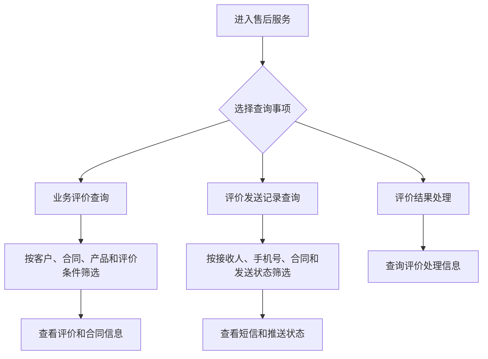
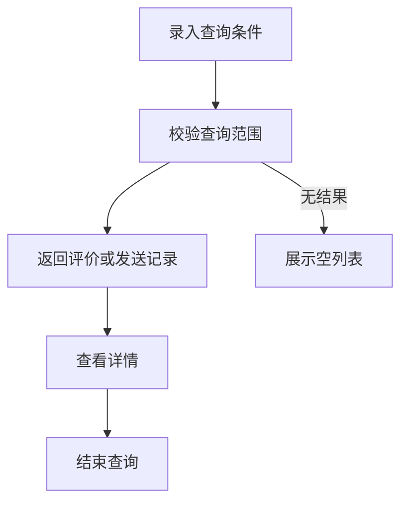
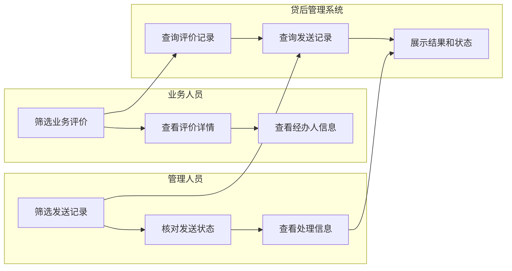

<!-- 标题路径: 售后服务（总体描述/评价发送记录查询） -->
<!-- ZJJK: ZJJK00104953, ZJJK00104969, ZJJK00109115, ZJJK00120093 -->
<!-- 场景/流程: 场景:FS00004649 -->

## 要点摘要

- 售后服务总述+评价发送记录查询：合同首笔借据放款成功后经短信平台/小程序发评价消息；发送记录按接收人名称、手机号、合同编号、主管客户经理、主管机构、放款日期、发送状态筛选。
- 详情含售后服务评价编号、监督投诉电话、短信信息、发送时间、推送状态；可查看关联合同信息。

## 关键规则/字段/校验

- 详见正文各界面【页面初始化】/【查询】/【重置】等按钮规则原文。

## 待湿测

- 文档口径与 SUT 实际差异需湿测确认：文中按钮/字段以需求文档为准，实际系统字段编码、菜单路径、权限角色可能不同。

---

# 售后服务
## 总体描述
### 功能说明
售后服务用于查询贷款客户业务评价、评价发送记录和评价结果处理信息。业务人员可以按客户、合同、借据、贷款账号、产品、机构、放款日期、评价日期、评价状态、评价结果和评价来源筛选评价记录，并查看合同信息、经办人信息、评价人手机号、评价日期和评价来源。评价发送记录查询提供短信接收人、手机号、合同、主管客户经理、主管机构、发送时间和发送状态等记录，便于跟踪评价通知是否已经送达。
评价结果处理用于承载评价结果处理信息查询页面并完成生命周期接入。客户经理视角会控制评价结果列的展示范围，管理视角可以查看更完整的评价结果和发送明细。
### 业务流程图
#### 客户经理操作全流程
描述售后评价查询、发送记录查看和评价结果处理查询路径。

```
#### 审批流程
查询类功能未体现审批流转，主要按条件检索并查看记录。

```
#### 角色×外部系统泳道
展示业务人员、管理人员和系统查询职责。

```
### 状态说明
评价状态 - 业务评价记录是否已经完成客户评价的阶段标识
状态清单：
未评价：评价记录尚未收到客户评价结果，查询时若评价结果选择“未评价”，系统按评价状态为“未评价”筛选。
已评价：客户已完成评价，列表和详情可展示评价结果、评价人手机号、评价日期和评价来源。
超时未评价：超过评价截止时间仍未形成有效评价结果，页面按评价状态展示并支持查询。
状态机：
未评价 → 客户完成评价 → 已评价
未评价 → 超过评价截止时间 → 超时未评价
发送状态 - 售后服务评价通知短信发送进展的阶段标识
状态清单：
未发送：评价通知尚未推送，发送记录可按该状态筛选和查看。
已发送第1次：评价通知已完成第一次发送，列表反显最近一次发送日期和发送状态。
已发送第2次：评价通知已完成第二次发送，发送记录继续保留短信信息和推送状态供核对。
不用再发送：评价通知不再继续发送，发送记录仅用于查询和核对。
状态机：
未发送 → 首次发送评价通知 → 已发送第1次
已发送第1次 → 再次发送评价通知 → 已发送第2次
已发送第2次 → 停止继续发送 → 不用再发送
## 评价发送记录查询
### 查看评价发送记录
#### 总体说明
无
##### 功能说明
查看评价发送记录用于查询售后服务评价通知的发送明细。用户在评价发送记录查询列表主页按接收人名称、接收人手机号、合同编号、主管客户经理、主管机构、放款日期和发送状态筛选记录。进入任务页或查看发送记录列表后，可以查看售后服务评价编号、接收人、合同、主管机构、监督投诉电话、放款日期、短信信息、发送时间和推送状态。
查看合同信息页面用于核对发送记录关联的合同详情，列表排序会按用户选择的列重新查询发送记录，方便定位近期发送或异常发送的评价通知。
##### 业务流程
进入评价发送记录查询列表→按接收人名称、接收人手机号、合同编号、主管客户经理、主管机构、放款日期和发送状态筛选发送记录→选择一条评价发送记录→点击查看进入评价发送记录详情→查看短信信息、发送状态、最近一次发送日期和最后修改时间→切换发送记录列表查看流水号、推送统一消息平台时间、发送时间和推送状态→查看合同信息核对关联合同。
##### 功能描述
支持查询评价发送记录，并查看所选记录的评价详情。
##### 操作权限
[TABLE 316]
机构层级 | 角色 | 操作权限 | 数据权限
| 区系统管理员 | 【查询】、【重置】、【接收人名称】、【更多】、【查看】 | 展示全行的数据
| 系统管理员 | 【查询】、【重置】、【接收人名称】、【更多】、【查看】 | 本机构的数据
[/TABLE 316]
##### 操作步骤
【贷后管理】→【售后服务】→【评价发送记录查询】
步骤1：查看评价发送记录查询列表。
步骤2：输入接收人手机号、合同编号、主管客户经理，或点击接收人名称打开客户搜索弹窗后选择客户。
步骤3：点击更多按钮后，查看主管客户经理、主管机构、放款日期、发送状态等更多查询条件；再次点击后收起更多查询条件。
步骤4：选择主管机构、放款日期或发送状态后，点击【查询】筛选评价发送记录；点击【重置】清除已填写条件。
步骤5：在列表中选择一条评价发送记录后，点击【查看】打开评价详情。
##### 界面原型
##### 业务要素
输入要素
[TABLE 317]
字段名称 | 字段编码 | 类型 | 长度 | 是否必填 | 显示类型 | 默认值 | 规则及说明
接收人名称 | cstNm | 文本框 | 200 | 否 | 文本 |  | 通过弹窗【客户放大镜选择器(ZJJK00109101)】选择数据
接收人手机号 | mblphNo | 文本框 | 11 | 否 | 文本 |
合同编号 | ctrNo | 文本框 | 32 | 否 | 文本 |
主管客户经理 | cstmgrNm | 文本框 | 200 | 否 | 文本 |
主管机构 | hdlInst | 树选择器 |  | 否 | 文本 |  | 通过【获取机构树-租户ID条件】选择
放款日期 | dsbrDt | 日期输入框 |  | 否 | 日期 |
发送状态 | sendSt | 字典下拉框 |  | 否 | 字典 |  | 取全量字典：发送状态(sndSt); 字典项明细：1:未发送；2:已发送第1次；3:已发送第2次；4:不用再发送
【查询】 |  | 操作按钮组 |  | 按钮 |  | 点击按钮，触发查询
【重置】 |  | 操作按钮组 |  | 按钮 |  | 点击按钮，重置表单
[/TABLE 317]
输出要素
[TABLE 318]
字段名称 | 字段编码 | 类型 | 长度 | 是否必填 | 显示类型 | 默认值 | 规则及说明
接收人名称 | cstNm | 列表 |  | 否 | 文本 |  | 系统反显
接收人手机号 | mblphNo | 列表 |  | 否 | 文本 |  | 系统反显
合同编号 | ctrNo | 列表 |  | 否 | 文本 |  | 系统反显
主管客户经理 | cstmgrNm | 列表 |  | 否 | 文本 |  | 系统反显
主管机构 | hdlInstNm | 列表 |  | 否 | 文本 |  | 系统反显
放款日期 | dsbrDt | 列表 |  | 否 | 日期 |  | 系统反显
发送状态 | sendSt | 列表 |  | 否 | 字典 |  | 系统反显; 字典：发送状态(sndSt); 字典项明细：1:未发送；2:已发送第1次；3:已发送第2次；4:不用再发送
最近一次发送日期 | createTime | 列表 |  | 否 | 日期 |  | 系统反显
【查看】 |  | 列表头按钮组 |  | 按钮 |  | 点击【查看】按钮，进入页面【查看评价发送记录】
[/TABLE 318]
##### 业务规则
###### 【页面初始化】规则
显示查询区域、评价发送记录列表。
###### 【接收人名称】规则
点击接收人名称搜索图标时，系统打开客户搜索弹窗，弹窗提供个人客户和企业客户选择。
在客户搜索弹窗点击确认后，系统将所选客户名称展示在接收人名称中。
###### 【查询】按钮规则
点击【查询】，系统根据查询条件筛选评价发送记录。
###### 【重置】按钮规则
点击【重置】时，系统清空查询条件。
##### 外部调用接口
无
#### 查看
##### 【查看】按钮规则
点击【查看】时，系统校验已选择一条评价发送记录；未选择有效记录时提示“请选择有效数据”。
校验通过后，系统打开所选评价发送记录的评价详情，只可查看不可编辑。
###### 系统管理员查看评价发送记录
######## 功能描述
系统展示评价发送记录的查看页面。
######## 操作权限
[TABLE 319]
机构层级 | 角色 | 操作权限 | 数据权限
| 区系统管理员、系统管理员 | 【返回】 | 按业务条件查询，无身份维度隔离
[/TABLE 319]
######## 操作步骤
【贷后管理】→【售后服务】→【评价发送记录查询】→【查看评价发送记录】
步骤1：进入页面后，查看合同信息和发送记录列表两个页签。
步骤2：点击返回后回到上一页。
######## 界面原型
######## 业务要素
######## 业务规则
######### 【页面初始化】规则
系统默认展示合同信息和发送记录列表两部分。
######## 外部调用接口
无
######## 功能描述
查看评价发送记录中的合同信息详情。
######## 操作权限
[TABLE 320]
机构层级 | 角色 | 操作权限 | 数据权限
— | 系统管理员 |  | 按业务条件查询，无身份维度隔离
[/TABLE 320]
######## 操作步骤
【贷后管理】→【售后服务】→【评价发送记录查询】→【查看】→【评价发送记录查询详情】→【系统管理员查看评价发送记录】→【查看合同信息】
步骤1：进入评价发送记录查询详情页面，查看合同信息。
步骤2：查看售后服务评价编号、接收人名称、接收人手机号、合同编号、主管客户经理、主管机构、主管机构监督投诉电话、放款日期、短信信息、发送状态、最近一次发送日期和最后修改时间。
######## 界面原型
######## 业务要素
输入要素
[TABLE 321]
字段名称 | 字段编码 | 类型 | 长度 | 是否必填 | 显示类型 | 默认值 | 规则及说明
售后服务评价编号 | assNo | 文本框 | 32 | 否 | 文本 |  | 不可编辑
接收人名称 | cstNm | 文本框 | 200 | 否 | 文本 |  | 不可编辑
接收人手机号 | mblphNo | 文本框 | 11 | 否 | 文本 |  | 不可编辑
合同编号 | ctrNo | 文本框 | 32 | 否 | 文本 |  | 不可编辑
主管客户经理 | cstmgrNm | 文本框 | 200 | 否 | 文本 |  | 不可编辑
主管机构 | hdlInstNm | 文本框 | 200 | 否 | 文本 |  | 不可编辑
主管机构监督投诉电话 | hdlInstSpvsCplnTel | 文本框 | 30 | 否 | 文本 |  | 不可编辑
放款日期 | dsbrDt | 日期输入框 |  | 否 | 日期 |  | 不可编辑
短信信息 | msgCntnt | 文本域 |  | 否 | 文本 |  | 不可编辑
发送状态 | sendSt | 字典下拉框 |  | 否 | 字典 |  | 取全量字典：发送状态(sndSt); 字典项明细：1:未发送；2:已发送第1次；3:已发送第2次；4:不用再发送；不可编辑
最近一次发送日期 | createTime | 日期输入框 |  | 否 | 日期 |  | 不可编辑
最后修改时间 | createTime | 文本框 |  | 否 | 文本 |  | 不可编辑
[/TABLE 321]
######## 业务规则
######### 【页面初始化】规则
展示字段：售后服务评价编号、接收人名称、接收人手机号、合同编号、主管客户经理、主管机构、主管机构监督投诉电话、放款日期、短信信息和发送状态。
各项仅可查看，不可编辑。
######## 外部调用接口
无
######## 功能描述
查看售后服务评价的发送记录明细。
######## 操作权限
[TABLE 322]
机构层级 | 角色 | 操作权限 | 数据权限
— | 系统管理员 |  | 按业务条件查询，无身份维度隔离
[/TABLE 322]
######## 操作步骤
【贷后管理】→【售后服务】→【评价发送记录查询】→【查看】→【评价发送记录查询详情】→【系统管理员查看评价发送记录】→【查看发送记录列表】
步骤1：进入评价发送记录查询详情页面，查看合同信息和发送记录列表。
步骤2：切换至发送记录列表页签，查看流水号、推送统一消息平台时间、发送时间和推送状态。
步骤3：点击列表表头排序时，按所选顺序查看发送记录列表。
######## 界面原型
######## 业务要素
输出要素
[TABLE 323]
字段名称 | 字段编码 | 类型 | 长度 | 是否必填 | 显示类型 | 默认值 | 规则及说明
流水号 | bsnJrnlNo | 列表 |  | 否 | 文本 |  | 系统反显
推送统一消息平台时间 | createTime | 列表 |  | 否 | 文本 |  | 系统反显
发送时间 | createTime | 列表 |  | 否 | 文本 |  | 系统反显
推送状态 | msgPshSt | 列表 |  | 否 | 字典 |  | 系统反显; 字典：文件推送状态代码(filePushStsCd); 字典项明细：0:未推送；1:成功；2:失败
[/TABLE 323]
######## 业务规则
######### 【页面初始化】规则
显示所选数据的查询发送记录，并按发送时间倒序展示。
######## 外部调用接口
无
