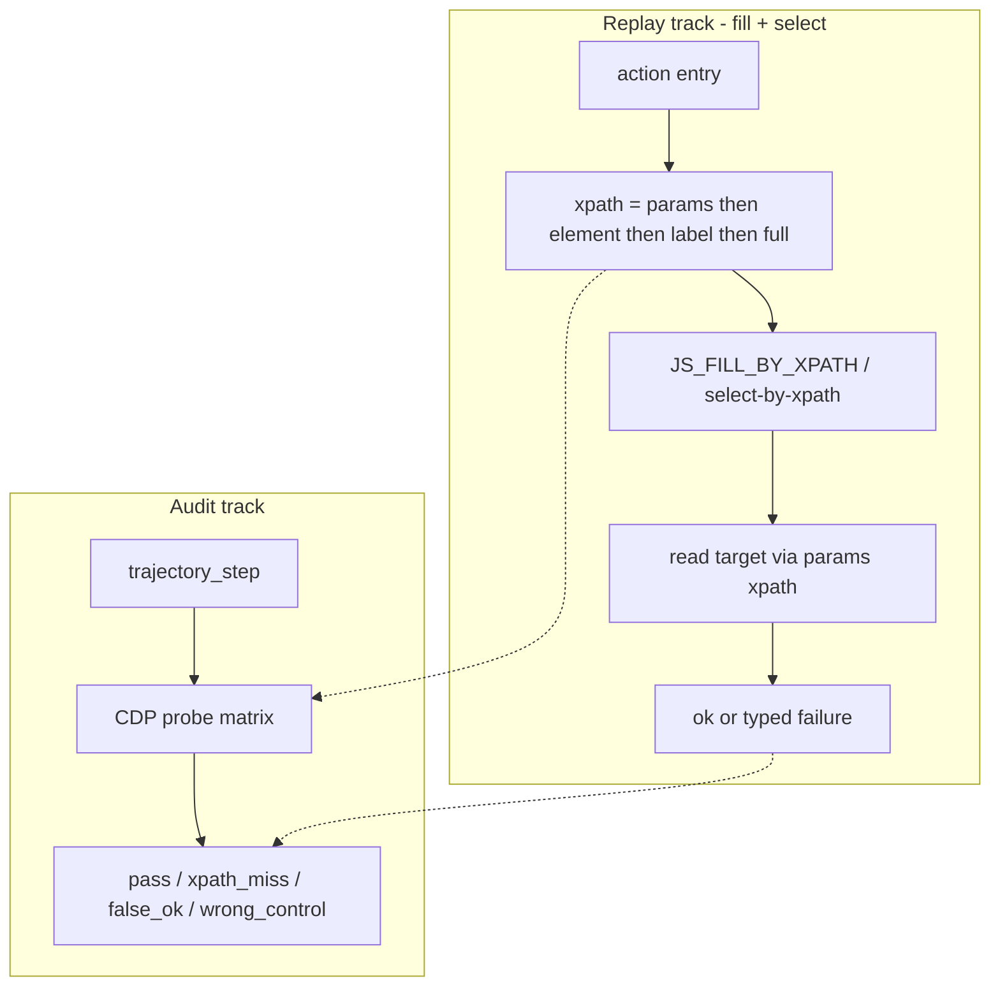

# Design: xpath params-first replay + ops audit

**Date:** 2026-08-08  
**Status:** Approved (brainstorm)  
**Scope cut:** Read-path unify for replay; audit matrix; fix `fill_form_field` + `select_option` only  
**Out of scope this cut:** Recording write-path unify (`element ≡ params`); other action behaviors; `RELATIVE_XPATH_PRIMARY` default; bulk `element_json` backfill

## Problem

After expanding AI beyond Element UI `.el-form-item` (full-DOM / table editable cells), scan stores **table-relative** `xpath_smart` on **params**, while `_capture_element` → `JS_SMART_LOCATOR(label)` regenerates a **form-item** xpath onto **element**. Live product replay prefers **element**, so:

- Table **selects** miss (`confirmed=0`).
- Table **fills** can report success while the target cell is unchanged (**false ok**): dead element xpath + label passed as `placeholderHint` + `want.includes(ph)` matching empty placeholders → `ok-placeholder`.

E2E (CDP `:9242`, traj **102** phase **4**, 对公评级「评级等级测算」页):

- 25/26 fails: `element` vis=0, `params` (`//tr…//el-select`) vis=1.
- `资产负债率`: element xpath miss; params xpath writable; fill with label-as-placeholderHint returned `ok-placeholder` while target stayed `45.50`.

## Goals

1. **Audit first (ops matrix):** classify every step on a trajectory/phase with shared success/failure taxonomy.
2. **Replay contract (fill + select):** prefer `params.xpath_smart`; verify by **read-back** on the target control; never treat false ok as success.
3. Old trajectories benefit **without re-record** when params already hold the good relative xpath.

## Non-goals (this cut)

- Force `element.xpath_smart === params.xpath_smart` at record time (follow-up).
- Change date / radio / tree / click replay behavior beyond audit reporting.
- Treat `option_text=first` as a valid selection (fail explicitly).

## Decisions (locked)

| Topic | Choice |
|-------|--------|
| Overall strategy | Audit + immediate replay fix for fill/select only |
| Evidence | DB + CDP probes (traj 102 / phase 4) |
| Locator source of truth (read) | **`params.xpath_smart` first** |
| Success | Action `ok*` **and** read-back of target via params xpath matches expected |
| Failure classes | `xpath_miss` / `false_ok` / `wrong_control` (+ `bad_option_text`, `params_absent`) |
| Dual-write params≠element | **Read unify now**; write unify later |
| Implementation approach | Replay-layer hot fix (not full record/replay dual-end unify in one PR) |

## Architecture

Shared rules: locator priority and failure taxonomy are the same for the audit simulator and replay.

## Why params ≠ element today

| Sink | Generator | Table-row typical |
|------|-----------|-------------------|
| `params.xpath_smart` | Scan `tableFieldXpathSmartOf` / form `formFieldXpathSmartOf` written in auto-fill `_record_action` params | `//tr[.//*='…']//el-select\|input` |
| `element.xpath_smart` | `_capture_element` → `JS_SMART_LOCATOR(label)` → form-item leaf | `//el-form-item[label…]//input` (often 0 hits on table UIs) |

Params do **not** always carry relative xpath (e.g. some tree selects / clicks / manual paths). This cut’s replay fix is strongest for assistant fill/select steps that already store `params.xpath_smart`.

## Audit matrix (§2)

**Input:** `trajectory_id` (default 102), optional `phase_number` (default 4); page already on target UI via CDP `:9242` or executor session.

**Per-step columns:** id, action, label, params_xs, element_xs, xpath_source_used, params_hit, element_hit, class, note.

**Classes:**

| Class | Meaning |
|-------|---------|
| `pass` | Chosen xpath hits; read-back matches expected |
| `xpath_miss` | Chosen xpath visible hits = 0 (no usable fallback) |
| `false_ok` | Would/did return `ok*`, but params-xpath target unchanged / ≠ expected |
| `wrong_control` | Write landed on a non-target control |
| `params_absent` | No params smart (stats only) |
| `skip` | Non-DOM write without bind (e.g. unbound `save_form_snapshot`) |
| `bad_option_text` | e.g. `option_text=first` |

**Action policy:** code-change + green for `fill_form_field` / `select_option`; **report-only** for date/radio/tree/click/snapshot/others. Output: console + optional JSON (not persisted to MySQL).

## Replay contract — fill / select (§3)

### Locator resolution

1. `params.xpath_smart` if non-empty and starts with `//` or `(`  
2. Else `element.xpath_smart` / candidates  
3. Else label semantic (`JS_FILL_FORM_FIELD` / existing select label path)  
4. Else `xpath_full`

### fill_form_field

1. Call shared `JS_FILL_BY_XPATH` with resolved xpath; **third arg = real placeholder only** (never pass label as placeholderHint).  
2. Placeholder fallback: hint non-empty **and** `ph` non-empty **and** `ph.includes(hint)` — remove `want.includes(ph)`.  
3. On xpath miss → label → xpath_full.  
4. **Read-back** via params xpath (else the xpath actually written); normalize-compare to expected. Map mismatches to typed failures.

### select_option

1. Same xpath priority; prefer `JS_SELECT_TRIGGER_BY_XPATH` + exact `option_text`.  
2. Reject `option_text=first` (and similar sentinels) as `bad_option_text`.  
3. Read-back selected label; mismatch → `false_ok` / `wrong_control`.

### `_result_ok`

Only true `ok*` prefixes count as success. `false_ok` / `wrong_control` / `xpath_miss` / `bad_option_text` must **not** set `confirmed=1`.

## Error surface (§4)

| Class | Result prefix | confirmed |
|-------|---------------|-----------|
| Success | `ok…` (optional `locate=params\|element\|label`) | 1 |
| Miss | `xpath_miss:…` / `xpath-not-found` / `label-not-found` | 0 |
| False ok | `false_ok:…` | 0 |
| Wrong control | `wrong_control:…` | 0 |
| Bad option | `bad_option_text:…` | 0 |

## Verification

1. Extend `characterize-xpath-fill-select`: empty placeholder must not yield `ok-placeholder`; params preferred over element.  
2. CDP audit script: default traj 102 / phase 4.  
3. Point E2E on rating page: `资产负债率` no false ok on element-only path; params path read-back OK; `业务往来及使用` params `//tr…//el-select` triggerable.  
4. Keep `characterize-locator-candidates` / `characterize-ctrl` / replay import smoke green.  
5. Acceptance: phase-4 fill+select with **valid** `params.xpath_smart` → matrix `pass`; `option_text=first` and params-absent listed separately.

## Follow-up

1. **Write-path unify:** `_capture_element` / persist must copy scan/params xpath into `element` (no blind form-item regenerate for table Source B).  
2. Extend read-back contract to date / radio / tree / clicks.  
3. Optional: heal must not record `option_text=first`.

## Primary code touchpoints

- `scripts/actions/_replay.py` — locator pick, fill/select orchestration, read-back, `_result_ok`  
- `scripts/actions/_js_snippets.py` — `JS_FILL_BY_XPATH` placeholder guard (shared with assistant)  
- New characterization / CDP audit script under `scripts/characterization/`  
- Docs: this spec; CHANGELOG if control-plane-visible semantics change (scripts-only may note briefly)
